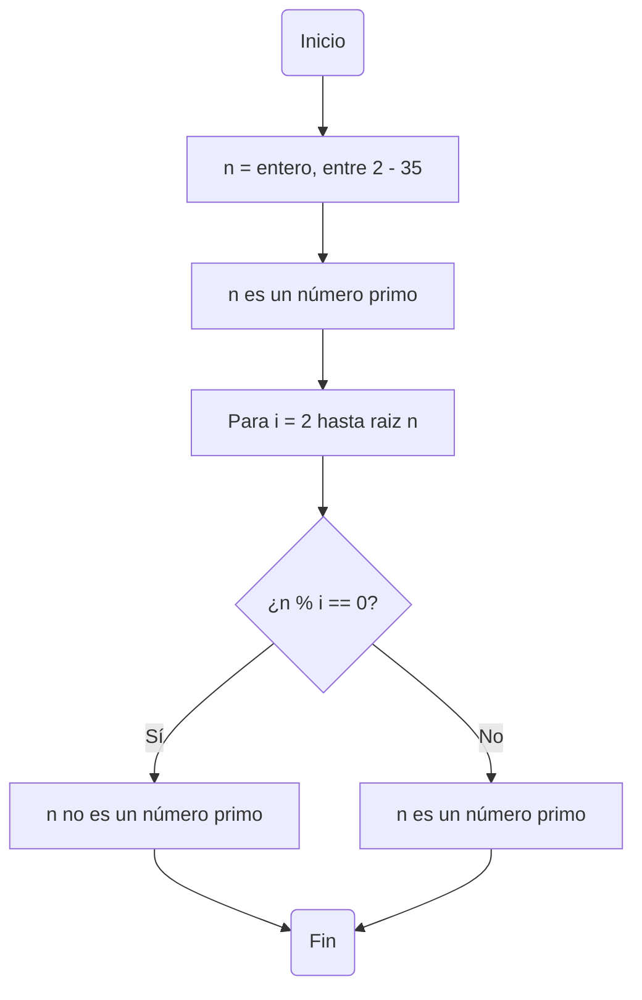

# reto_tres

Resolver el siguiente problema:

## El Problema

Plantear el algoritmo para obtener los números primos desde 2 hasta n. Representar con Pseudocódigo y un Diagrama de Flujo.

## Pasos a Seguir

1. Establecer el rango (2 - n).
   - En este caso, estableceremos el rango entre (2-35).

2. Para cada número n dentro de nuestro rango, se relizara la comprobación i=2 hasta raiz de (n).
  - 2.1 Si el residuo es 0, no es primo.
  - 2.2 Si el residuo es diferente a 0, se dara por primo.

3. El número 2 se excluye y se asume desde un inicio como primo.


## Lo mencionado anteriormente en Pseudocódigo:

```pseudocode
//variables  hallar_primos
n = entero
limite = entero
inicio
  limite = 35
  n = (2,35)
  es_primo = VERDADERO                                   //se asume que n es primo hasta demostrar lo contrario
  Para i = 2 hasta raiz de (n) hacer
    Si modulo(n,i) == 0 entonces
      es_primo = FALSO
      fin
    Fin si
  Fin para

  Si es_primo entonces
    escribir("n es un número primo")
  sino
    escribir("n no es un número primo")
  Fin si
fin

```
## Diagrama de Flujo


